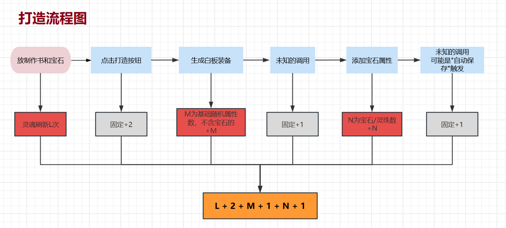
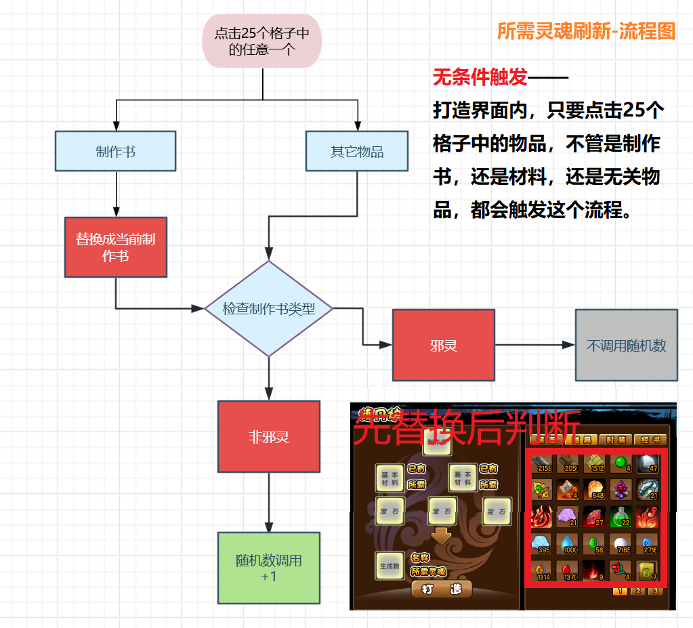
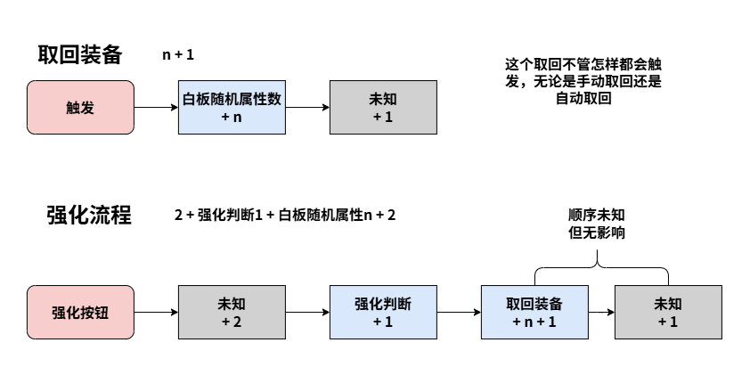
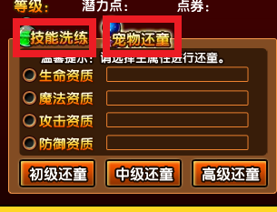
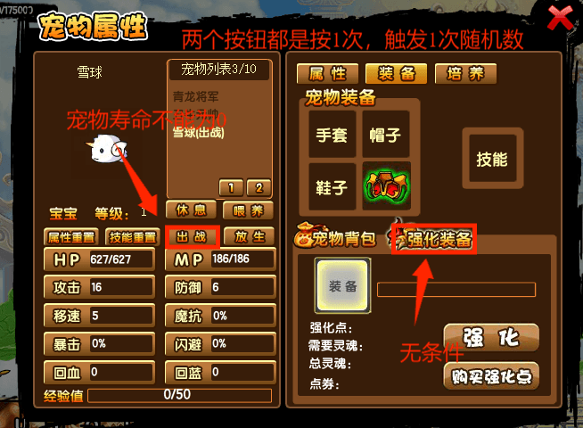
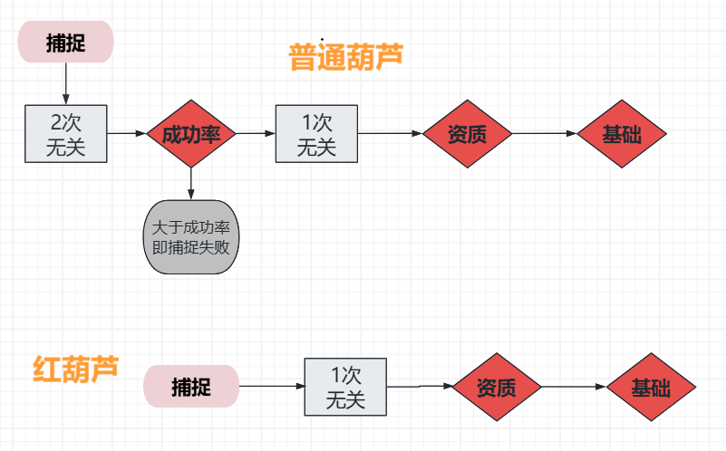
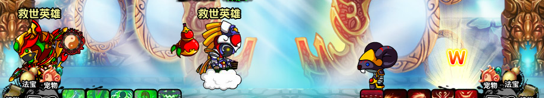

# 造梦西游3 随机数计算器

> 本项目纯AI，零手工🤖 
> 代码及注释里的内容无法保证完全可靠 

> **本计算器并非纯绿**!!!使用前请先判断自己是否能接受 
> 对于游戏运行的干涉:  
> 计算器(0干涉)📱 \< 脚本📃 \< 变速齿轮⚙️ 
> 从涉及到的层面来看 
> 脚本(操作)📃 \< 计算器(游戏逻辑)📱 \< 变速齿轮(系统)⚙️ 

## 关于随机数

造梦西游3的随机数都是直接使用math.random() ，其源码在 <a href="https://github.com/adobe-flash/avmplus/blob/master/core/MathUtils.cpp#L1542" title='avm仓库'>avm仓库↗</a> 

> 随机数的种子数是2^31 - 1个，取值范围是1 ~ 2^31，而且是乱序循环的。 
> 也就是说，只要复刻游戏的机制。在游戏里获取观测值(斗部群星、还童等)，然后把这些种子挨个代入到游戏的机制里，再与观测值对比，就能筛选出可能的种子。只要观测值够多，最后总是可以得到唯一种子。俗称暴力破解。 

> 另外，还有一种极快的搜索方法(<a href="https://eprint.iacr.org/2019/086.pdf" title="高级功法">高级功法↗️</a>)，但是需要未经过截断的随机小数。 
> 当前游戏获取原始随机数的方法仅有保存游戏，该随机数在浏览器的F12工具里看得到。但是360游戏大厅因为内核过于古老😡，不支持，得借助其它工具去看。 

## 属性计算机制

游戏里面有很多隐藏的随机数调用，可能是动画或者反作弊调用的。来源不明，但次数固定能测出来。  
这些随机数按照位置分类可分为:  
`计算前，计算中，和计算后`。  
因为计算后的随机数不会影响装备/宠物的属性，所以一般不会去测，本文档没说明不代表一定没有。但是对于获取种子，前中后的次数是一定要全部弄清楚的。 

### 打造-灵魂刷新

我觉得一张图能比一坨文字把机制展示得更加清楚。 

重头戏是灵魂刷新，既影响了打造，又在打造界面提供了一个快速过随机数的方法。先放图。 

获取打造所需灵魂的代码 

`switch(quality){`  
    `case "粗 糙":`  
        `return 50 + RandomControllor.getIns().getRandom();`  
    `case "普 通":`  
        `return 100 + RandomControllor.getIns().getRandom();`  
    `case "优 秀":`  
        `return 200 + RandomControllor.getIns().getRandom();`  
    `case "精 良":`  
        `return 400 + RandomControllor.getIns().getRandom();`  
    `case "史 诗":`  
        `return 800 + RandomControllor.getIns().getRandom();`  
    `case "传 说":`  
        `return 1600 + RandomControllor.getIns().getRandom();`  
    `default:`  
        `return 0;`  

因为math.random() \< 1，小数会被舍弃，所以所需灵魂数不变，但实实在在地消耗了随机数。 

每当点击一次25个格子的一个时，都会刷新打造界面，连带着所需灵魂一起刷新。至于为什么邪灵制作书不一样，只能说程序猿把邪灵给忘了，使用默认值0。这也是打造邪灵装备不消耗灵魂这个冷门特性的成因😑 

>值得注意的是，替换制作书先于所需灵魂刷新。也就是说，打造台是空的，把制作书放上去，消耗一次随机数。上面已经有了传说制作书，把邪灵制作书换上去，不消耗随机数。 

### 强化

话不多说，直接放图。 

> 取回装备n + 1的消耗来自游戏的反作弊函数isTheSameEquipmentByFillName，该函数会创建一件临时装备，对比临时装备和强化装备的装备名字。 

> 合成也会触发该函数(触发位置存疑)，打造不触发。在强化里作为计算后的随机数，不影响强化成败。 

面板上看到的强化成功率经过取整，显示得不完整。单个强化石实际的成功率是 

| 目标强化等级 - 强化石等级 | 成功率 |
| :---: | :---: |
| < 0 | 1 |
| 0 | 0.375 |
| 1  | 0.09 |
| 2  | 0.02 |
| 3  | 0.0058 |
| > 3 | 0 |

### 合成

> 合成相关内容理得不是很清晰。基本靠游戏里测出来的。 

可借鉴打造和强化，不放图。 
`总 = 计算前a + 白板装备n + 计算后b`  
只测试了不同装备的a值，b值没测。a值在`src/scenarios/equipment.ts 的 BEFORE_ATTR_RANDOMS` 

#### 太极八卦

非法宝装备的n值都是其白板随机属性数，法宝为随机属性数+1(判断单双五行)或+2(双五行抽两次五行)。并且属性计算顺序是成长生命魔法...五行。只有太极八卦例外，先把基础属性算完，中间插了**1次无关随机数**，最后设置成长。

### 掉落物

极其简单的一节。 
| 事件 | 触发时机 |
| :-: | :-: |
| 掉落物种类 | 击败boss |
| 掉落物属性 | 拾起 |
> 也就是说，可以先把掉落物刷出来，再过随机数，控制装备属性。非常奈斯👍

### v4属性重置

比还童更简单，从打开法宝界面到洗属性，完全没有无关随机数。 
函数是refreshSutraAttribute()。一共两部分计算。
> 成长率(小于2.5才算): 
>- 2次
>1. 向上取整产生成长率浮动(1, 2, 3); 
>2. 决定浮动是增还是减; 

> 五行: 
>- 2~3次
>1. random() > 0.91 双五行，否则单五行
>2. 抽取单五行;
>3. 把有的五行从抽取列表删掉，再抽取第二个五行 

### 药园还童

药园还童必定会消耗的无关随机数:
1. 打开药园，1次
2. 打开潜力商店，1次，因为自动打开了技能洗练界面
3. 宠物洗练和宠物还童的界面按钮

两个按钮都是按1次消耗1次随机数，可以用作控制随机数。

#### 还童的计算
1. 没有计算前和计算中的无关随机数，计算后有但不影响。
2. 四个资质。顺序是`生命->魔法->攻击->防御`。选择哪个主资质，就把主资质放最前面。共3次。
    - 还童就像分蛋糕，第一个分完，第二个从剩下的分，分到最后那个人就没得分，剩多少就多少。所以是3次。
    - 主资质有保底分配，`初级还童保底 = 等级，中/高级保底 = 等级 * 2`
3. 四维基础。有的宠物生命、魔法、攻击、防御基础值是随机的。共4次。

### 宠物背包

宠物背包同时提供了种子获取和精准消耗的功能，极大方便了关内控制随机数。良心大大滴。😋

#### 宠物界面

依旧一张图。

### 宠物捕捉

还是一张图。
资质->(+基础4)，普通葫芦=无关2->成功率1->红葫芦流程" title="葫芦捕捉">
> 普通葫芦比红葫芦多了一个成功率判断，很多红葫芦能抓的极限资质种子，对于普通葫芦来说是不可行的。而且，同一个档次的资质，普通葫芦要过数倍于红葫芦的种子数，具体取决于成功率。在随机数控制这方面，红葫芦比普通葫芦强太多了。

## 种子获取

### 斗部群星

源代码:  
`bname = ["醉翁","白面猿猴","七香车","聚宝天官"];`  
`gc.randomMonster = RandomControllor.getIns().getRandom() * 4;`  
`fbbgmc.gotoAndStop(bname[gc.randomMonster]);`  

游戏中少数的均匀抽取之一。四个boss分别对应数字0, 1, 2, 3。 
经实测 
- 计算前有**2次**无关随机。
- 要18+个值才能稳定获取种子。

### 丹药还童

丹药还童和普通还童类似，只是默认主资质为生命，并且没有等级保底，相当于保底为0。 还童丹本身没什么用，但其强大之处在于给v5提供了一个简单易用的种子获取方式。 

还童丹仅计算后有无关的随机数。p1/2使用是2次，邀请的p3是1次。

| —— | 四维固定 | 四维浮动 |
| :-: | :-: | :-: |
| p1/2 | 5 | 9 |
| p3 | 4 | 8 |

> 还童丹的浮动很大，6枚丹的主资质基本保证获取种子了。

#### 宠物盔甲进阶

非v5没有还童丹，在关内稳定获取观测样本的方法便是进阶宠物盔甲。 
叱咤/赤烟四件套在进阶时，会增加一个随机属性。手套和帽子变动范围太窄，鞋子的取整方式不好处理，所以首选盔甲作为样本源。 

计算
- 每次进阶宠物胸甲时，都会产生1~5的额外魔抗，并且极值减半。
- 魔抗计算是第1次随机数，后面有5次无关调用，所以周期是6。
- 无初始随机数的情况下，全空间搜索需要14+次强化；而局部搜索只需要8~9次。

#### 保存游戏

保存游戏的url里面包含ran=12345.6789.....位数足够多，能够完整还原原始随机整数 

优点:
- 速度极快
- 仅需2个随机数 或 起始种子 + 1个随机数
- 触发源多样，关内可使用v4重置，v3两重置，喂技能、属性、还童丹

缺点:
- 对v2及以下不友好😡
- 360游戏大厅不支持(这不应该是大厅的缺点吗?🤔)

## 操作事项

### 斗部群星

1. 清空灯笼并退出昆仑山重进。

- 左摇右摆的灯笼会不停调用随机数，就算打掉了，依然会像"幽灵"般存在。

2. 脱下花宴和镇魂花坠并等待绿字完全消失。

- 出现1个回血的绿字会产生1次随机数。

3. 不能携带宠物。

- 宠物ai会调用随机数。

4. 打完一阶Boss要刷新网页。

- 不刷新网页，每次返回地图都会自动打开一次二阶boss界面。虽然和正常打开一样都是3次，但可能会打乱节奏。

5. 不能打开背包，技能等其它界面，减少不必要操作。

> 自十五周年更新后，斗部群星在地图界面和昆仑山同时存在。除非v4属性重置，否则没必要去昆仑山里面。**在地图界面只要注意第4点即可**。

### 掉落物 & 宠物捕捉

#### 影响掉落物的因素

---

1. 怪物ai，不多说，所以先清怪，实在不能清怪，可以先用镇魂玉箫让怪物ai停止;

2. 击杀怪物后，怪物死亡动画，漂浮的灵魂，都会有影响;

3. 伤害/回血数字;

4. 无双，可能是无双特效会调用用随机函数;

5. 宠物ai，记得收回宠物;

实际会遇到的因素包括但不限于上面这些;

#### 影响宠物的因素

---

宠物捕捉比掉落物多了个野生宠物ai的影响。 

没法用玉箫催眠。唯一方法是保持安全距离，只要离得够远，宠物向目标靠近的过程不会调用随机数。但是葫芦捕捉距离远小于安全距离，很难在安全距离捕捉宠物。 

目前的一个方法是邀请p3悟空吸引仇恨。

先用悟空烈焰闪吸引仇恨，然后跑到地图另一侧。p1站地图中间抓宠物。因为仇恨在p3，所以p1靠近宠物也没事。

#### 宠物捕捉技巧

v3卡888，将宠物洗到111能压缩培养周期。但是宝宝用v3的洗练只能洗到222，除非再花钱去买属性丹，才能将宝宝洗到111。 
> - 实际上，虽然资质是捕捉时决定，但品质是普通还是宝宝在掉落时就决定了。野生宝宝的特点是，吃一发烈焰闪血条会掉一大半，而普通的血比较厚。 
> - 因此，可以预留足够距离，双开刷boss，直到确认是普通再过种子。